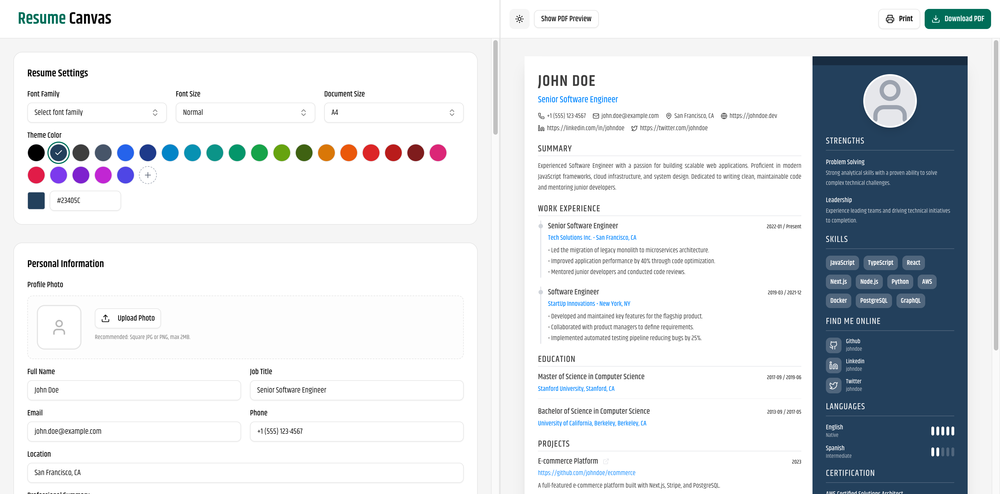
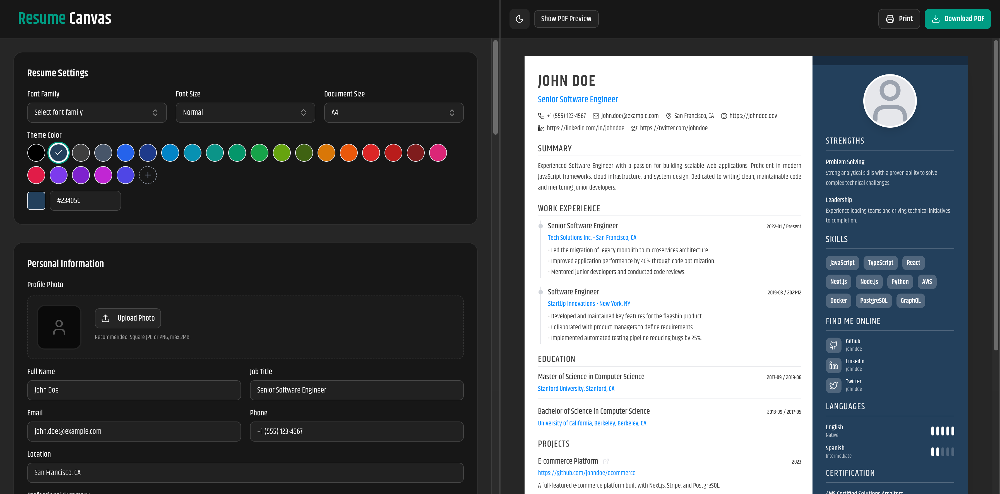

# Resume Canvas 📄

<div align="center">



<p align="center">
  <a href="#features">Features</a> •
  <a href="#tech-stack">Tech Stack</a> •
  <a href="#getting-started">Getting Started</a> •
  <a href="#contributing">Contributing</a> •
  <a href="#license">License</a>
</p>

[](https://opensource.org/licenses/MIT)


</div>

## 🚀 Overview

**Resume Canvas** is a modern, open-source resume builder designed to be simple, fast, and privacy-focused. Build your professional resume in minutes with a real-time preview and export it as a high-quality PDF.

Unlike other resume builders, **Resume Canvas** runs entirely in your browser. Your data never leaves your device unless you choose to share it. No sign-ups, no paywalls, no tracking.

## ✨ Features

- **👀 Real-time Preview:** See your changes instantly as you type.
- **🔒 Privacy First:** All data is stored locally in your browser (Local Storage).
- **📄 PDF Export:** High-quality, selectable, and ATS-friendly PDF generation using `@react-pdf/renderer`.
- **🎨 Customization:**
  - Multiple fonts (Google Fonts integration).
  - Custom theme colors.
  - Adjustable font sizes and document margins.
- **🌗 Dark/Light Mode:** Fully supported dark mode for late-night editing.
- **📱 Responsive Design:** Edit your resume on the go with a mobile-friendly interface.
- **🧩 Drag & Drop:** Reorder sections easily (Coming Soon).

## 📸 Screenshots

|                             Light Mode                             |                            Dark Mode                             |
| :----------------------------------------------------------------: | :--------------------------------------------------------------: |
|  |  |

## 🛠️ Tech Stack

- **Framework:** [Next.js 15](https://nextjs.org/) (App Router)
- **Language:** [TypeScript](https://www.typescriptlang.org/)
- **Styling:** [Tailwind CSS](https://tailwindcss.com/)
- **UI Components:** [Shadcn/UI](https://ui.shadcn.com/) & [Lucide React](https://lucide.dev/)
- **State Management:** [Zustand](https://github.com/pmndrs/zustand)
- **PDF Generation:** [@react-pdf/renderer](https://react-pdf.org/)
- **Forms:** React Hook Form

## 🏁 Getting Started

Follow these steps to set up the project locally on your machine.

### Prerequisites

- Node.js 18+ installed
- pnpm (recommended), npm, or yarn

### Installation

1.  **Clone the repository:**

    ```bash
    git clone https://github.com/kstmostofa/resume-canvas.git
    cd resume-canvas
    ```

2.  **Install dependencies:**

    ```bash
    pnpm install
    # or
    npm install
    ```

3.  **Run the development server:**

    ```bash
    pnpm dev
    # or
    npm run dev
    ```

4.  **Open your browser:**
    Navigate to [http://localhost:3000](http://localhost:3000) to see the application running.

## 🤝 Contributing

Contributions are what make the open-source community such an amazing place to learn, inspire, and create. Any contributions you make are **greatly appreciated**.

1.  Fork the Project
2.  Create your Feature Branch (`git checkout -b feature/AmazingFeature`)
3.  Commit your Changes (`git commit -m 'Add some AmazingFeature'`)
4.  Push to the Branch (`git push origin feature/AmazingFeature`)
5.  Open a Pull Request

## 📄 License

Distributed under the MIT License. See `LICENSE` for more information.

## 🙏 Acknowledgments

- [Shadcn/UI](https://ui.shadcn.com/) for the beautiful component library.
- [React PDF](https://react-pdf.org/) for the powerful PDF rendering engine.
- [Lucide](https://lucide.dev/) for the clean icons.

---

<div align="center">
  Made with ❤️ by <a href="https://github.com/kstmostofa">Md Mostafijur Rahman</a>
</div>
